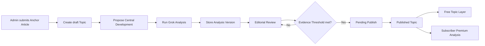
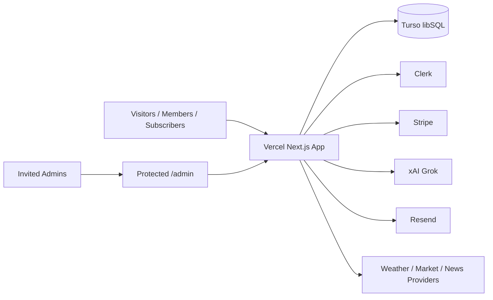

# OmniDoxa Architecture

OmniDoxa is a Next.js application hosted on Vercel with Turso/libSQL as the primary database, Clerk for identity, Stripe for subscriptions, and xAI/Grok as the first AI analysis provider.

## Architecture Documents

- `INFRASTRUCTURE.md`: deployment topology, external services, and security boundaries.
- `DATABASE.md`: entity relationships, core tables, and data rules.
- `APPLICATION_STRUCTURE.md`: app route structure, API areas, and module boundaries.
- `docs/database/schema.sql`: initial Turso/libSQL schema reference.

## Core Flow

## Data Boundary

Public APIs return only:

- Topic title and metadata
- Neutral Topic Summary
- Discourse Preview
- Anchor Article link
- Locked Premium Analysis metadata

Subscriber-only APIs return:

- Full Left, Center, and Right Viewpoints
- Verified Social Posts
- Historical Analysis Versions when enabled

Admin APIs return:

- Draft and review state
- Candidate Social Posts
- Raw AI output references
- Queue and lifecycle controls

## Infrastructure Boundary

## Implementation Notes

- Keep route handlers small and typed.
- Keep provider-specific logic behind adapters.
- Store raw AI output in `topic_analysis_runs`.
- Never edit Social Post text.
- Enforce Premium Analysis access server-side.
- Keep Basic Briefing provider choices explicit before implementation.
- Clerk authenticates identity, while OmniDoxa grants Admin and Subscriber access.

## Phase 2 Public UI

- Public home and Topic detail scaffolding was originally built with placeholder Topics.
- Shared public layout components live in `src/components/layout/`.
- Public Topic UI components live in `src/components/topics/`.
- Locked Premium Analysis panels show redacted evidence previews only; no full Viewpoint or Social Post text is exposed in the public free layer.

## Phase 3 Admin Topic Creation

- `/admin` is the manual Anchor Article intake desk and draft Topic queue.
- `POST /api/admin/articles/preview` authenticates the Admin request, fetches article metadata, normalizes the URL, hashes it, proposes Central Development text, and returns Duplicate Candidates without writing.
- `GET /api/admin/topics` returns an Admin queue DTO with Topic summary, anchor source metadata, and Material Update counts.
- `POST /api/admin/topics` creates a draft Topic plus anchor `topic_articles` row when the Admin chooses `create_new`, or attaches the article as a Material Update when the Admin chooses `attach_material_update`.
- `POST /api/admin/topics/[id]/material-updates` fetches a URL and attaches it to an existing Topic as a Material Update.
- Duplicate detection is advisory. It uses exact normalized URL hash matches plus title/source similarity and requires an explicit Admin decision before any write.
- Phase 3 uses the existing `topics`, `topic_articles`, and `topic_updates` tables. No schema change was required.
- Admin APIs require Clerk identity plus an active OmniDoxa Admin grant.
- Article fetching rejects credentials, non-default ports, local/private hosts, reserved IP ranges, non-HTTP schemes, excessive redirects, oversized responses, and non-HTML responses before metadata extraction.

## Phase 4 Grok Analysis And Editorial Review

- `POST /api/admin/topics/[id]/analyze` requires Admin access, calls xAI's Responses API with `web_search` and `x_search`, validates JSON, requires plausible X/Twitter status URLs, stores the raw response in `topic_analysis_runs`, and inserts versioned `topic_viewpoints` plus candidate `topic_social_posts`.
- `GET /api/admin/topics/[id]/analysis` returns the current Analysis Version for Admin Editorial Review only.
- `POST /api/admin/topics/[id]/review` lets Admins edit editorial summaries, verify or reject candidate Social Posts without editing post text, and moves the Topic to `pending_publish` only when at least two verified posts exist for each Left, Center, and Right Viewpoint.
- Topics in `review` are blocked from publish server-side until the Evidence Threshold is satisfied. Older draft placeholder publishing remains available for Topics that have not entered analysis review.
- Public APIs continue to expose only locked sentiment metadata from approved current analysis and never expose full Viewpoint summaries, Social Post text, candidate evidence, or raw AI output.

## Phase 5 Publish Flow And Live Data

- Phase 5 is implemented before Phase 4. Draft Topics can be published manually with temporary free-layer placeholder analysis.
- `POST /api/admin/topics/[id]/publish` requires an active Admin grant, marks a Topic as `published`, fills missing Neutral Topic Summary and Discourse Preview fields, and records a lifecycle update.
- `POST /api/admin/topics/[id]/archive` requires an active Admin grant, marks a Topic as `archived`, clears browse placement, and records a lifecycle update. Archived Topics remain directly viewable by slug and are eligible for future public search.
- `POST /api/admin/topics/[id]/hide` requires an active Admin grant, marks a Topic as `hidden`, clears promotion, and records a lifecycle update. Hidden Topics are not returned by public list or detail APIs.
- `POST /api/admin/topics/[id]/placement` requires an active Admin grant and updates main page, category feed, and promoted main story placement.
- `DELETE /api/admin/topics/[id]` requires an active Admin grant and soft-deletes a Topic by marking `topics.status = 'deleted'`, clearing public placement, and writing a lifecycle update. Related articles, Analysis Versions, Social Posts, and raw AI output remain retained for audit/debugging.
- `GET /api/topics` returns published-only public Topic DTOs with free-layer metadata, anchor article links, placement-aware filtering, sentiment labels/counts from approved current analysis only, and locked Premium Analysis metadata only.
- `GET /api/topics/[id]` returns one public-viewable Topic DTO by slug when status is `published` or `archived`.
- Public pages render published Turso data only. Empty feeds show an empty state instead of fake placeholder articles.
- Public Topic art uses the Anchor Article `image_url` when captured. Remote article images are rendered client-side rather than through the Next image optimizer to avoid server-side remote image fetch risk.
- Public live-data mapping must not expose full Viewpoint summaries, Social Post text, candidate evidence, raw AI output, or subscriber-only Premium Analysis.

## Phase 6 Auth And Basic Briefing

- Clerk is installed through `@clerk/nextjs` and wired with a Next.js 16 `src/proxy.ts` plus conditional `ClerkProvider`.
- Clerk wiring only activates when usable `NEXT_PUBLIC_CLERK_PUBLISHABLE_KEY` and `CLERK_SECRET_KEY` values are present, so local shells can still build before service setup.
- OmniDoxa creates or updates `members` rows from the signed-in Clerk user email on demand.
- `OMNIDOXA_ADMIN_EMAILS` is a comma-separated first-version invitation allowlist. When a matching signed-in Member appears, OmniDoxa inserts an active `admin_grants` row if one does not already exist.
- `/admin` redirects to `/admin/article-desk`. `/admin/article-desk` manages Anchor Article intake, editorial review, and the filterable story table for publish/archive/hide/delete operations. `/admin/access` manages email-based Basic, free Premium, and Admin access overrides.
- `/admin` no longer asks for a visible Admin token/password. When Clerk is configured, the admin layout renders portal sections only for active Admin grants.
- Admin APIs call `requireAdmin()` before article fetches, Topic writes, placement updates, publish, archive, hide, and delete actions. The legacy token fallback has been retired.
- `/briefing` renders the Basic Briefing configuration UI for Members and stores supported preferences through `POST /api/briefing/preferences`.
- Basic Briefing persistence currently covers location, stock tickers, news categories, and delivery time. Weather and market providers remain explicit Phase 6 follow-up decisions before live external data is shown.
- `access_overrides` stores email-keyed grants before or after sign-in. Basic maps to free Member access, free Premium contributes to effective Subscriber access without overwriting future Stripe state, and Admin syncs an active `admin_grants` row after sign-in.
- Admin access changes are available through `GET /api/admin/access`, `POST /api/admin/access`, and `DELETE /api/admin/access/[id]`.
