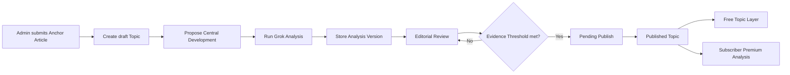
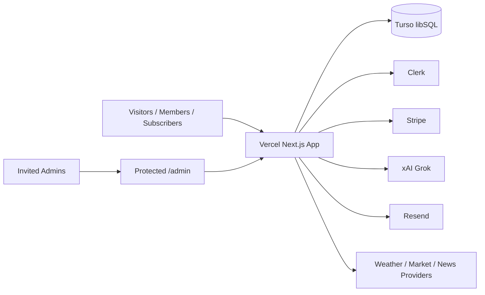

# OmniDoxa Architecture

OmniDoxa is a Next.js application hosted on Vercel with Turso/libSQL as the primary database, Clerk for identity, Stripe for subscriptions, and xAI/Grok as the first AI analysis provider.

## Architecture Documents

- `INFRASTRUCTURE.md`: deployment topology, external services, and security boundaries.
- `DATABASE.md`: entity relationships, core tables, and data rules.
- `APPLICATION_STRUCTURE.md`: app route structure, API areas, and module boundaries.
- `docs/database/schema.sql`: initial Turso/libSQL schema reference.

## Core Flow

## Data Boundary

Public APIs return only:

- Topic title and metadata
- Neutral Topic Summary
- Discourse Preview
- Anchor Article link
- Locked Premium Analysis metadata

Subscriber-only APIs return:

- Full Left, Center, and Right Viewpoints
- Verified Social Posts
- Historical Analysis Versions when enabled

Admin APIs return:

- Draft and review state
- Candidate Social Posts
- Raw AI output references
- Queue and lifecycle controls

## Infrastructure Boundary

## Implementation Notes

- Keep route handlers small and typed.
- Keep provider-specific logic behind adapters.
- Store raw AI output in `topic_analysis_runs`.
- Never edit Social Post text.
- Enforce Premium Analysis access server-side.
- Keep Basic Briefing provider choices explicit before implementation.

## Phase 2 Public UI

- Public home and Topic detail pages currently render from `src/lib/placeholder-topics.ts`.
- Shared public layout components live in `src/components/layout/`.
- Public Topic UI components live in `src/components/topics/`.
- Locked Premium Analysis panels show redacted evidence previews only; no full Viewpoint or Social Post text is exposed in the placeholder public layer.
