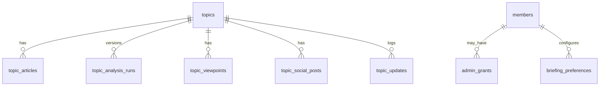

# Database Architecture

## Entity Relationship



## Core Tables

- `topics`: public editorial records.
- `topic_articles`: Anchor Articles, Material Updates, and references.
- `topic_analysis_runs`: raw AI output and review status per Analysis Version.
- `topic_viewpoints`: Left, Center, Right summaries and sentiment scores.
- `topic_social_posts`: candidate and verified Social Posts.
- `topic_updates`: lifecycle and timeline events.
- `members`: Clerk-linked OmniDoxa accounts.
- `admin_grants`: invitation-based Admin authorization.
- `briefing_preferences`: Member briefing configuration.

## Schema Source

The canonical Phase 1 Turso/libSQL schema lives at `docs/database/schema.sql`.

Apply the schema with:

```bash
npm run db:apply
```

The command reads `docs/database/schema.sql` and requires real `TURSO_DATABASE_URL` and `TURSO_AUTH_TOKEN` values in `.env.local`.

Typed application entities live in `src/lib/schema.ts`. Keep those types aligned with schema changes.

## Data Rules

- Re-analysis creates a new Analysis Version.
- Original AI output is preserved.
- Social Post text is not edited.
- Publish readiness requires the Evidence Threshold.
- Subscriber access controls full Premium Analysis.
