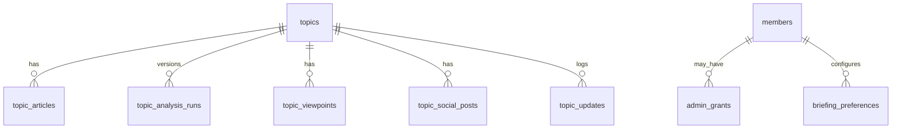

# Database Architecture

## Entity Relationship



## Core Tables

- `topics`: public editorial records.
- `topic_articles`: Anchor Articles, Material Updates, and references.
- `topic_analysis_runs`: raw AI output and review status per Analysis Version.
- `topic_viewpoints`: Left, Center, Right summaries and sentiment scores.
- `topic_social_posts`: candidate and verified Social Posts.
- `topic_updates`: lifecycle and timeline events.
- `members`: Clerk-linked OmniDoxa accounts.
- `admin_grants`: invitation-based Admin authorization.
- `briefing_preferences`: Member briefing configuration.

## Schema Source

The canonical Turso/libSQL schema lives at `docs/database/schema.sql`.

Apply the schema with:

```bash
npm run db:apply
```

The command reads `docs/database/schema.sql` and requires real `TURSO_DATABASE_URL` and `TURSO_AUTH_TOKEN` values in `.env.local`.

Typed application entities live in `src/lib/schema.ts`. Keep those types aligned with schema changes.

## Phase 3 Usage

Admin Topic Creation uses the existing `topics`, `topic_articles`, and `topic_updates` tables:

- New Anchor Article intake creates a `topics.status = 'draft'` row and one `topic_articles.article_role = 'anchor'` row.
- Material Updates create a `topic_articles.article_role = 'material_update'` row and one `topic_updates.update_type = 'material_update'` row.
- Duplicate Candidate warnings are advisory and are not persisted yet.

## Phase 4 Usage

Grok analysis and Editorial Review use the existing versioned analysis tables:

- Running analysis increments `topics.analysis_version`, stores the raw xAI response in `topic_analysis_runs`, inserts three `topic_viewpoints` rows, and inserts candidate `topic_social_posts` rows for the same version.
- Candidate Social Posts start as `review_status = 'candidate'` and `is_verified = 0`.
- Editorial Review updates summary fields and marks Social Posts as `verified` or `rejected`.
- `topic_analysis_runs.review_status = 'approved'` only when the Evidence Threshold is met: at least two verified posts for each Left, Center, and Right Viewpoint.
- Topics move from `review` to `pending_publish` only after that threshold is satisfied.

## Phase 5 Usage

Publish, hide, and placement use the existing Topic lifecycle schema plus Phase
5 placement columns:

- Publishing updates `topics.status = 'published'` and fills missing free-layer summary fields with temporary placeholder analysis.
- Archiving updates `topics.status = 'archived'`, clears browse placement, and keeps the Topic directly viewable by slug.
- Hiding updates `topics.status = 'hidden'` and removes the Topic from public list and detail reads.
- `topics.main_feed_enabled` controls whether a published Topic appears on the main page feed.
- `topics.category_feed_enabled` controls whether a published Topic appears in its category feed.
- `topics.is_featured_main` and `topics.featured_at` control the promoted main page story. Promoting one Topic clears the previous promoted Topic.
- Both publish and hide write lifecycle rows to `topic_updates`.
- Public browse reads filter to `topics.status = 'published'` and expose only free-layer fields plus locked Premium Analysis metadata.
- Public detail reads allow `topics.status IN ('published', 'archived')`; hidden Topics return 404.
- Existing databases can receive the additive placement columns through `npm run db:apply`; the app also includes a temporary runtime guard while Phase 5 is being stabilized.

## Phase 6 Usage

Member, admin, and briefing access uses `members`, `admin_grants`,
`access_overrides`, and `briefing_preferences`:

- Signing in with Clerk creates or updates one `members` row by `clerk_user_id`.
- `OMNIDOXA_ADMIN_EMAILS` can bootstrap an active `admin_grants` row for matching signed-in Members.
- `access_overrides` stores email-keyed Basic, free Premium, and Admin overrides before or after sign-in.
- Free Premium overrides contribute to effective Subscriber access without overwriting `members.subscription_status`, preserving room for future Stripe state.
- Admin overrides sync to `admin_grants` only after the matching email signs in with a verified Clerk email.
- Basic Briefing preferences store location, watchlist tickers as JSON, news categories as JSON, and delivery time.
- The current schema does not enforce one `briefing_preferences` row per Member; the application reads and updates the oldest row for the Member and inserts one when missing.

## Data Rules

- Re-analysis creates a new Analysis Version.
- Original AI output is preserved.
- Social Post text is not edited.
- Publish readiness requires the Evidence Threshold.
- Subscriber access controls full Premium Analysis.
