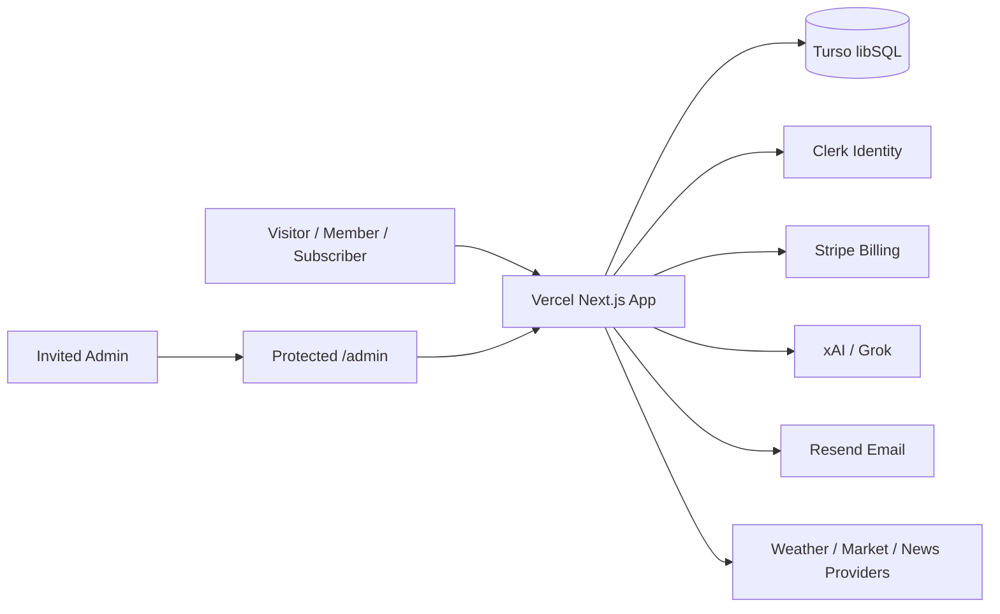

# Infrastructure Architecture

## Runtime Topology

## Deployment Model

- One Next.js application hosted on Vercel.
- Production shell URL: https://omnidoxa.vercel.app/
- Admin portal lives in the same app under protected `/admin`.
- Phase 3 Admin APIs use `OMNIDOXA_ADMIN_TOKEN` as a temporary server-side access gate until Clerk/Admin grants are wired.
- Clerk authenticates identity.
- OmniDoxa stores authorization grants.
- Turso stores application data.
- Stripe controls Subscriber access.

## Security Boundaries

- Public APIs must not expose Premium Analysis.
- Phase 3 Admin APIs require `OMNIDOXA_ADMIN_TOKEN` before any URL fetch or write. The long-term boundary is Clerk identity plus OmniDoxa Admin grant.
- Pipeline routes require `CRON_SECRET` when automation begins.
- URL fetching must be SSRF-aware.
- Secrets must remain server-side.
